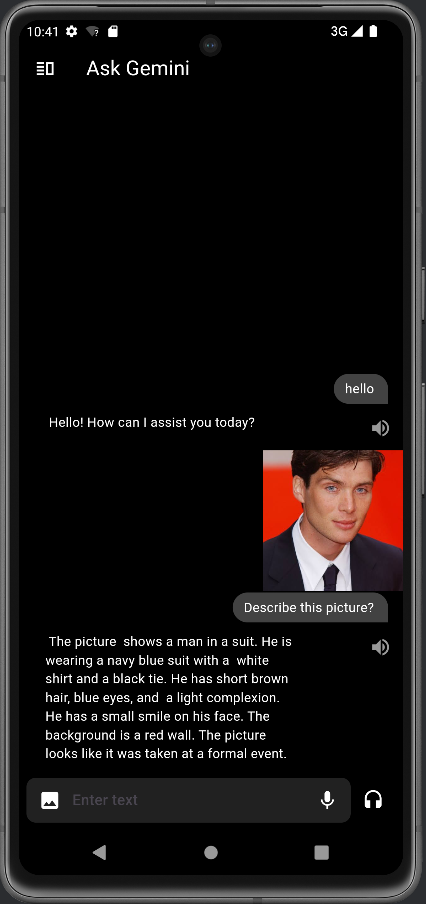
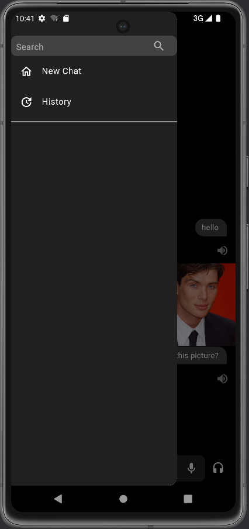
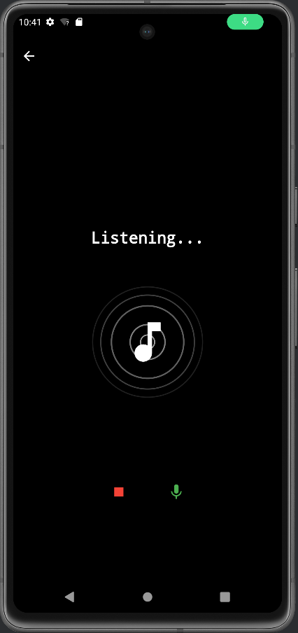

# Ask Gemini - A Flutter AI Chat Application

Ask Gemini is an AI-powered chatbot application built with Flutter. It integrates speech-to-text, text-to-speech, and image-based interaction features to allow users to communicate with a conversational AI called Gemini. Users can either type messages, speak directly, or send images to the chatbot to receive meaningful responses.

## Features

- **Text-based Chat:** Users can type questions or chat with the AI bot Gemini.
- **Voice Chat:** Integrates speech-to-text to allow users to speak to the bot, with real-time transcription and processing.
- **Image-based Queries:** Users can upload images from their gallery, and the app uses the Gemini AI to describe or respond to them.
- **Text-to-Speech:** The app reads Gemini's responses aloud, providing a hands-free experience.
- **Animated Splash Screen:** A beautiful, animated splash screen using Lottie animation provides a smooth transition while the app loads.
- **Real-time Chat Interface:** Displays an intuitive chat interface using the `dash_chat_2` package, including user avatars and chat bubbles.
- **Permissions:** Handles microphone and storage permissions to allow voice input and image selection.

## Splash Screen Animation

The app features a **Lottie animated splash screen** that enhances the user experience with a visually appealing loading animation. The splash screen is displayed when the app starts, offering a seamless and polished introduction before the chat screen loads.

- **Lottie**: The splash screen is implemented using the [Lottie package](https://pub.dev/packages/lottie), which allows for smooth, vector-based animations.

## Screenshots

## Tech Stack

- **Flutter:** The app is built with Flutter, a powerful framework for building cross-platform apps.
- **Packages used:**
  - `dash_chat_2` for the chat interface.
  - `chat_bubbles` for custom chat bubbles.
  - `flutter_tts` for text-to-speech functionality.
  - `speech_to_text` for converting voice input into text.
  - `flutter_gemini` for integrating Gemini AI.
  - `permission_handler` for handling Android/iOS permissions.
  - `image_picker` for selecting images from the gallery.
  - `lottie` for implementing the animated splash screen.

## Usage

- **Splash Screen**: After launching the app, users will see an animated Lottie splash screen, which adds a smooth transition to the chat interface.
- **Chat with Gemini**: Type a message in the text field and press the send button to communicate with Gemini.
- **Voice Input**: Press the microphone icon to speak directly to the AI. Your speech will be transcribed and sent automatically.
- **Image Upload**: Tap the photo icon to select an image from your gallery and ask Gemini to describe or respond to the image.
- **Text-to-Speech**: Gemini's responses will be displayed in the chat interface and can be read aloud by pressing the volume icon next to each message.

## Permissions

The app requests the following permissions:

- **Microphone**: Required for speech-to-text functionality.
- **Storage**: Required to select and upload images from the gallery.

## Contributing

Contributions, issues, and feature requests are welcome! Feel free to open an issue or a pull request.

