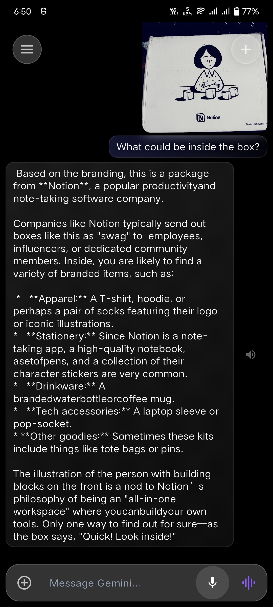
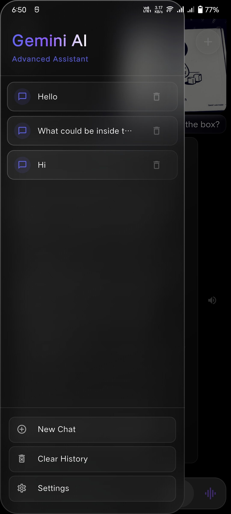
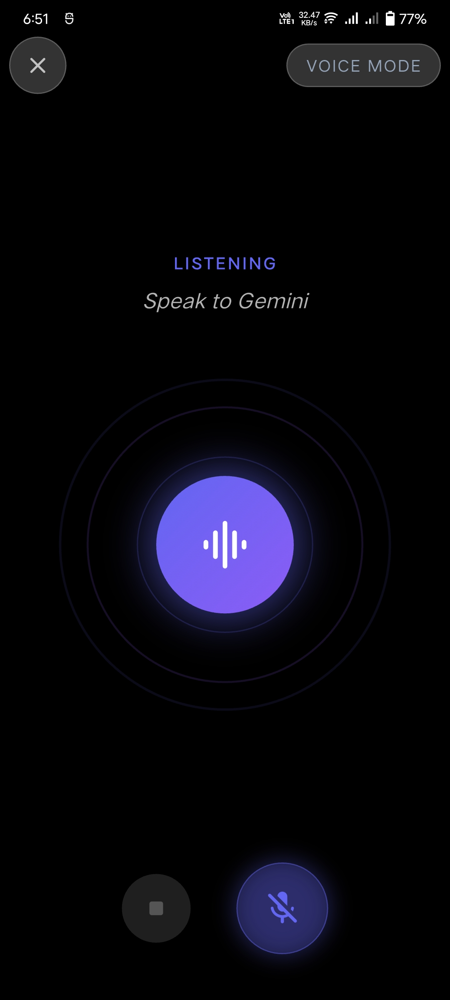

# Flutter-Chat-Bot Application (Premium Glassmorphism)

This is a premium, AI-powered chatbot application built with Flutter. It features a stunning **Glassmorphic UI** and integrates Gemini AI for a seamless conversational experience using text, voice, and images.

## ✨ Features

- **Premium Glassmorphism UI:** A modern, translucent design with real-time blur and vibrant gradients.
- **Gemini AI Integration:** Powered by Google's Gemini 1.5 Flash for intelligent text and image processing.
- **Voice Mode:** High-fidelity voice interaction with real-time waveform animation and text-to-speech.
- **Multi-modal Input:** seamlessly switch between typing, voice recognition, and image-based queries.
- **Session History:** Persistence-ready chat sessions managed via a robust history manager.
- **Modular Architecture:** Clean, maintainable codebase with extracted services and reusable components.

## 🏗️ Technical Architecture

The project follows a modular design to ensure high maintainability and scalability:

- **Services Layer:**
  - `GeminiService.dart`: Centralized API logic for streaming responses and handling multi-modal inputs.
  - `HistoryManager.dart`: Manages local storage and session persistence.

- **Component library (`lib/components/`):**
  - `AppGlassContainer`: Reusable glassmorphic styling engine.
  - `ChatBubble`: Advanced message rendering with sender-specific gradients.
  - `ChatInput`: Complex state-managed input controller for text, media, and voice.
  - `AnimatedOrb`: High-performance visual feedback for AI states.

## 📸 Screenshots

<p align="center">
  
  
  
</p>

## 🚀 Tech Stack

- **Framework:** [Flutter](https://flutter.dev)
- **AI Engine:** [Google Gemini](https://ai.google.dev/)
- **State Management:** StatefulWidget + Listeners
- **Key Packages:**
  - `flutter_gemini` (AI Logic)
  - `glassmorphism` (UI Core)
  - `speech_to_text` & `flutter_tts` (Voice)
  - `dash_chat_2` (Chat Framework)
  - `lottie` (Animations)

## 🛠️ Getting Started

1. **Clone the repository**
2. **Add your Gemini API Key** in `lib/const.dart`:
   ```dart
   const String GEMINI_API_KEY = "YOUR_API_KEY_HERE";
   ```
3. **Run the app**:
   ```bash
   flutter run
   ```

## 📜 Permissions

- **Microphone**: For voice-to-text functionality.
- **Storage/Gallery**: To upload and analyze images with Gemini.

## 🤝 Contributing

Contributions are welcome! If you have ideas for new glassmorphic components or AI features, feel free to fork and PR.
